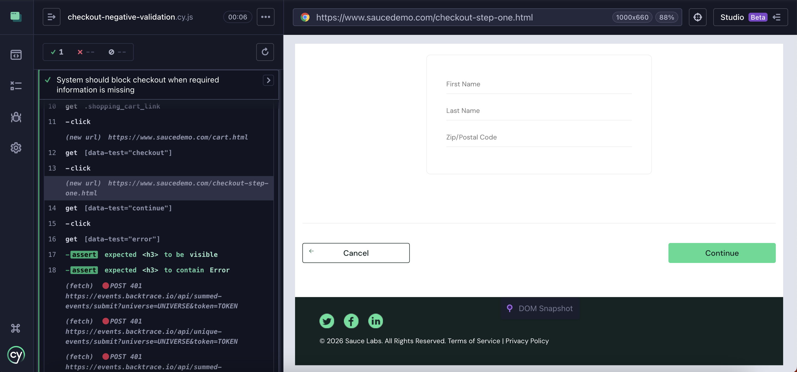
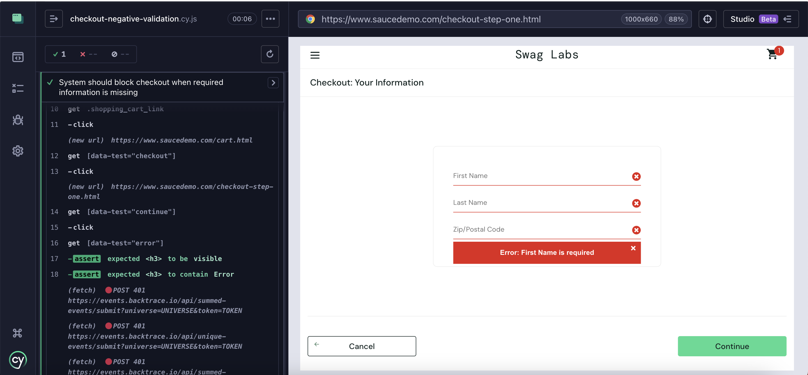

# QA Automation Portfolio — Cypress

This repository demonstrates an end-to-end test automation strategy focused on risk-based testing, critical user journeys, and business impact validation using Cypress.

The objective is not only validating functionality, but ensuring that revenue-critical flows behave reliably under both positive and negative scenarios.

---

## Test Strategy Overview

The automation approach follows a risk-oriented test design, prioritizing flows that directly impact conversion and checkout completion.

### Scope
- E-commerce checkout journey
- Mandatory field validation
- Revenue-critical purchase flow
- Negative validation scenarios

### Test Levels Covered
- End-to-End (E2E)
- Functional Validation
- Negative Testing
- User Flow Integrity

---

## Project Structure

cypress/
 ├── e2e/
 │    ├── revenue-critical/
 │    │     ├── cart-price-integrity.cy.js
 │    │     ├── checkout-funnel.cy.js
 │    │     ├── checkout-validation.cy.js
 │    │     └── checkout-negative-validation.cy.js
 │
 ├── fixtures/
 │    ├── user-data.json
 │    └── invalid-data.json
 │
 ├── pages/
 │    ├── HomePage.js
 │    ├── ProductPage.js
 │    ├── CartPage.js
 │    └── CheckoutPage.js
 │
 └── support/
       └── commands.js

docs/
 └── images/
       ├── tc-001-checkout-success.png
       └── tc-002-checkout-mandatory-validation.png

---

## Test Cases Implemented

### TC-001 — Checkout Successful Flow (Happy Path)

Objective  
Validate that a customer can successfully complete the checkout process.

Risk Covered  
- Revenue loss due to checkout failure  
- Broken purchase funnel  
- Payment progression interruption  

Validation  
- User navigates through cart  
- Checkout process completes successfully  
- Confirmation behavior validated  

Execution Evidence  

---

### TC-002 — Checkout Mandatory Fields Validation (Negative Scenario)

Objective  
Ensure the system blocks checkout progression when required information is missing.

Risk Covered  
- Invalid order creation  
- Data integrity issues  
- Backend processing failures  

Validation  
- User attempts to continue checkout without filling required fields  
- Error message is displayed  
- Checkout progression is prevented  

Execution Evidence  

---

## Business Risk Mapping

| Test Case | Business Risk | Impact Level | Mitigation |
|------------|--------------|--------------|------------|
| TC-001 Checkout Flow | Broken purchase funnel | High | Ensures revenue continuity |
| TC-002 Mandatory Validation | Invalid order creation | High | Prevents corrupted transactions |

### Why High Impact?

Checkout failures directly affect revenue generation and user trust.

Mandatory field validation prevents backend inconsistencies and financial discrepancies.

This prioritization reflects a product-driven QA approach rather than volume-based automation.

---

## Automation Design Decisions

### Page Object Model (POM)
Improves maintainability and scalability by separating:
- Test logic
- Page interactions
- Selectors

### Data Separation
Fixtures are used to simulate:
- Valid user scenarios
- Invalid input conditions

### Risk-Based Prioritization
Tests were selected based on business impact rather than feature quantity.

---

## Tools & Technologies

- Cypress
- JavaScript
- Node.js
- Page Object Model
- Git & GitHub

---

## How to Run the Tests

Install dependencies:

npm install

Open Cypress UI:

npx cypress open

Run in headless mode:

npx cypress run

---

## Future Improvements

- API interception and validation
- CI/CD pipeline integration
- Cross-browser execution
- Test reporting integration

---

## Author

Katrine Camarini Oyakawa

Product Manager transitioning into Quality Engineering, combining product thinking, operational strategy, and automation testing to improve system reliability and user experience.